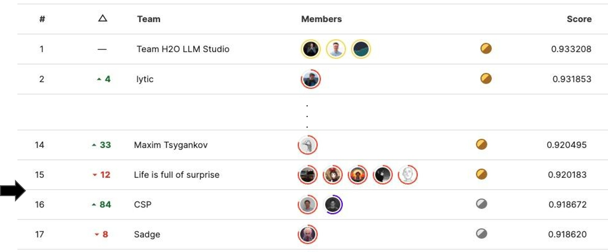
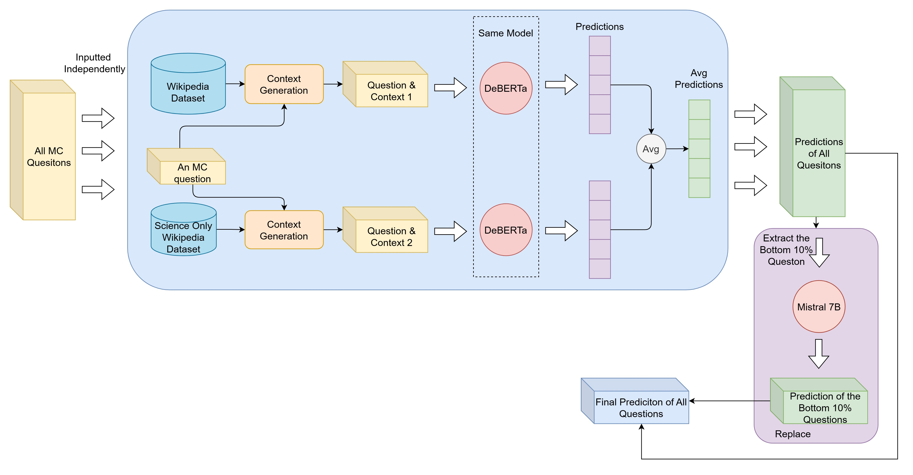

<!-- # LLM-Science-Exam


This repo contain the code for my final year project, 
which is a submission to the kaggle competition [Kaggle - LLM Science Exam](https://www.kaggle.com/competitions/kaggle-llm-science-exam).
This project was awarded the highest grade (A) in both term. 


The training data is avalible here:
https://www.kaggle.com/datasets/cdeotte/60k-data-with-context-v2 -->


# LLM for Scientific Multiple-Choice Question Answering

A Final Year Project from The Chinese University of Hong Kong, focused on developing a Retrieval-Augmented Generation (RAG) pipeline to  answer complex scientific MC questions using LLMs like DeBERTaV3 and Mistral 7B. 
Achieved **16th/2665** in a Kaggle competition with **MAP@3 of 0.919**, and received the **highest grade of A** in both terms.




## Key Features

- **Enhanced Context Generation**:  
  - Section-level retrieval from CirrusSearch Wikipedia dataset to avoid information loss.  
  - Dual embedding models (`e5-large-v2` and `bge-large-en-v1.5`) for diverse context retrieval.  
- **Model Architecture**:  
  - **DeBERTaV3** fine-tuned with LoRA for efficient training.  
  - **Mistral 7B** (QLoRA) for bottom 10% hardest questions with choice-swapping inference.  
- **Dataset**:  
  - **60,000 MC questions** (generated via GPT-3.5, SciQ, and EduQG).  
  - Improved Wikipedia datasets (science-focused and general articles).  
- **Ensemble Methods**:  
  - Average ensemble of predictions from dual-context DeBERTa.  

## Repository Structure
```
├── data/                   # Processed datasets (MC questions, Wikipedia sections)
├── models/                 # Fine-tuned DeBERTaV3 and Mistral 7B checkpoints
├── src/
│   ├── data_generation/    # GPT-3.5 MC question generation pipeline
│   ├── context_retrieval/  # context retrieval with similarity search with FAISS and cosine similarity
│   ├── training/           # LoRA/QLoRA fine-tuning scripts
│   └── inference/          # Ensemble and Mistral 7B inference pipelines
│   img/
└── README.md
```


## Results
| Model                     | Configuration               | MAP@3  |
|---------------------------|-----------------------------|--------|
| DeBERTaV3 (Ensemble)      | Dual-context + 60k data     | 0.914  |
| Mistral 7B + DeBERTa      | Mistral on the Bottom 10% questions        | 0.919  |

## References
- **Datasets**: [SciQ](https://arxiv.org/abs/1707.06209), [EduQG](https://arxiv.org/abs/2210.12487), [Kaggle Wikipedia](https://www.kaggle.com/datasets/jjimho/wikipedia-20230701)
- **Models**: [DeBERTaV3](https://huggingface.co/microsoft/deberta-v3-large), [Mistral 7B](https://huggingface.co/mistralai/Mistral-7B-v0.1)
- **Tools**: PyTorch, Huggingface, LoRA, QLoRA, FAISS, Sentence-BERT, Numpy, Pandas

